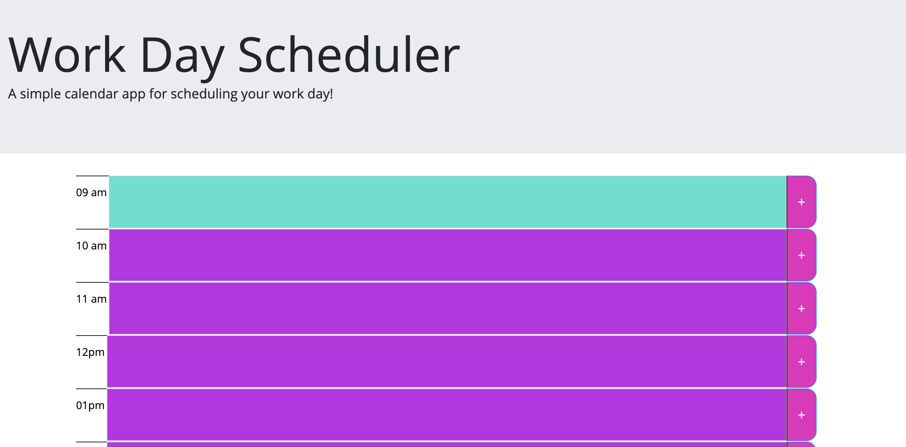

# DayPlanner

This application is simple way to schedule out your work day. Each hour time-block can be added to with a task or reminder, which is saved to local storage.

<h1>Installation</h1>

Simply navigate to https://juliealmeria.github.io/DayPlanner/ on your computer, tablet or smartphone. No installation required. 

<h2>How to Use</h2>

Click a time-block to enter whatever text you choose. Click the "+" button to add it to your day planner, as well as to local storage.

<h1>Versions</h1>

 Version 1.1.0 - Initial Launch - created and published 2.2.20 

